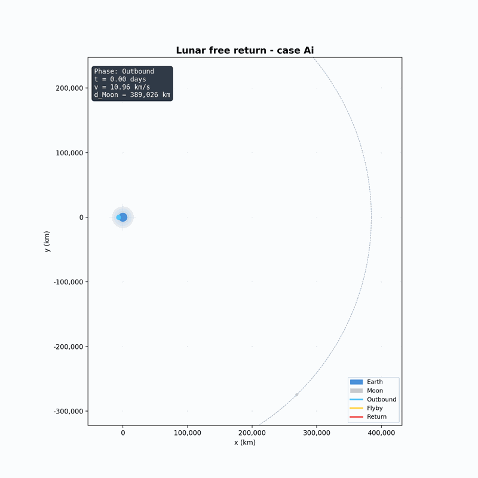

# Lunar Free Return

Numerical Earth-Moon free-return trajectory simulator using a two-dimensional
restricted N-body model and fourth-order Runge-Kutta integration.

The project reproduces Schwaniger's four canonical free-return families:

| Case | Direction | Flyby geometry | Notes |
| --- | --- | --- | --- |
| `Ai` | Prograde | Circumlunar | Apollo 13-style far-side flyby |
| `Aii` | Retrograde | Circumlunar | Opposite lunar encounter direction |
| `Bi` | Prograde | Cislunar | Earth-side lunar flyby |
| `Bii` | Retrograde | Cislunar | Earth-side retrograde variant |

## Example Outputs

The default `Ai` preset is an Apollo 13-style circumlunar free return: the probe
passes behind the Moon, bends around the far side, and returns ballistically to
Earth without a powered correction in this simplified model.



## Install

```bash
python -m pip install -e .
```

Install the optional Numba backend for faster repeated simulations:

```bash
python -m pip install -e ".[accel]"
```

The simulator automatically uses the accelerated backend when Numba is
available and falls back to pure NumPy/Python otherwise.

## Run

Print the default Apollo 13-style case:

```bash
lunar-free-return --case Ai
```

Generate figures:

```bash
lunar-free-return --case Ai --figures
```

Generate figures and an animated GIF:

```bash
lunar-free-return --case Bi --figures --gif --output output/Bi
```

## Python API

```python
from lunar_free_return import simulate, with_case

config = with_case("Ai")
result = simulate(config)

print(result.return_type)
print(result.diagnostic)
```

## Model

The probe is propagated in an inertial Earth-centered frame under Earth and Moon
gravity. Earth is fixed at the origin, the Moon follows a circular orbit, and the
probe starts from a 200 km low Earth orbit injection point. The initial injection
speed comes from the Hohmann transfer vis-viva equation, then each preset applies
a small speed and lunar phase adjustment to recover the selected Schwaniger case.

Distances are stored in SI units internally. Plots convert positions to
kilometers and times to days.

## Development

```bash
python -m pip install -e ".[dev]"
pytest
```

## License

MIT
